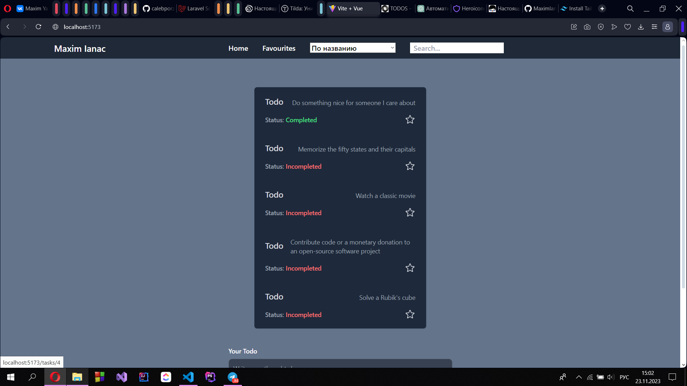

## Инструкции по установке проекта

1. Установить npm
    npm install
2. Установить все необходимые библиотеки
    vue-router axios

## Описание проекта

Проект предоставляет todo список, которые вытягиваются из общедоступного API dummyjson.
Присутствуют некоторые возможности взаимодейтсвия: добавление в избранные, добавление новых todo в локальный стейт, а также представленны возможности Vue роутера.

## Примеры использования

1. Отображение всех списков. По монтированию компонента в ДОМ выполняется запрос на сервер, получая список элементов

2. Имеется возможность сортировки и поиска

3. Возможность добавлять в избранные

## Ответы на контрольные вопросы

1. Node.js - это среда выполнения JavaScript, которая позволяет запускать JavaScript на сервере. Это платформа, построенная на движке JavaScript V8 от Google, и она позволяет разработчикам создавать высокопроизводительные и масштабируемые сетевые приложения. Node.js часто используется для создания веб-серверов, API, микросервисов, инструментов командной строки и других типов приложений.

2. Webpack и Vite:
Webpack и Vite - это инструменты для сборки приложений веб-разработки.

Webpack: Это мощный инструмент для сборки веб-приложений. Он позволяет объединять и управлять множеством файлов (JavaScript, CSS, изображений) в единый бандл для оптимизации загрузки и производительности приложения. Webpack также поддерживает множество плагинов и лоадеров для различных задач сборки.

Vite: Это новый инструмент, предназначенный для быстрой разработки веб-приложений. Он использует модульную систему ESM (ECMAScript Modules) для быстрой и мгновенной загрузки кода в режиме разработки. Vite позволяет быстро собирать проекты благодаря предварительной сборке на стороне клиента, используя быстрые ESM и другие инновационные технологии.

3. Маршрутизация (routing) в веб-разработке:
Маршрутизация - это процесс определения пути и направления трафика в веб-приложении или на веб-сайте. Она позволяет управлять отображением различных видов контента (страниц) в зависимости от URL-адреса, который посетитель запросил.

В веб-разработке маршрутизация обычно связана с одностраничными приложениями (SPA), где различные участки интерфейса отображаются в зависимости от URL без перезагрузки всей страницы. Для этого часто используются библиотеки маршрутизации, такие как React Router для React или Vue Router для Vue.js, которые управляют динамической загрузкой компонентов и отображением содержимого на основе URL.

4. Реактивность в веб-приложениях - это концепция, которая описывает способность приложения отслеживать и реагировать на изменения данных или состояния. Основная идея реактивности заключается в том, что если данные изменяются, то все зависящие от них элементы или компоненты автоматически обновляются для отображения этих изменений.
