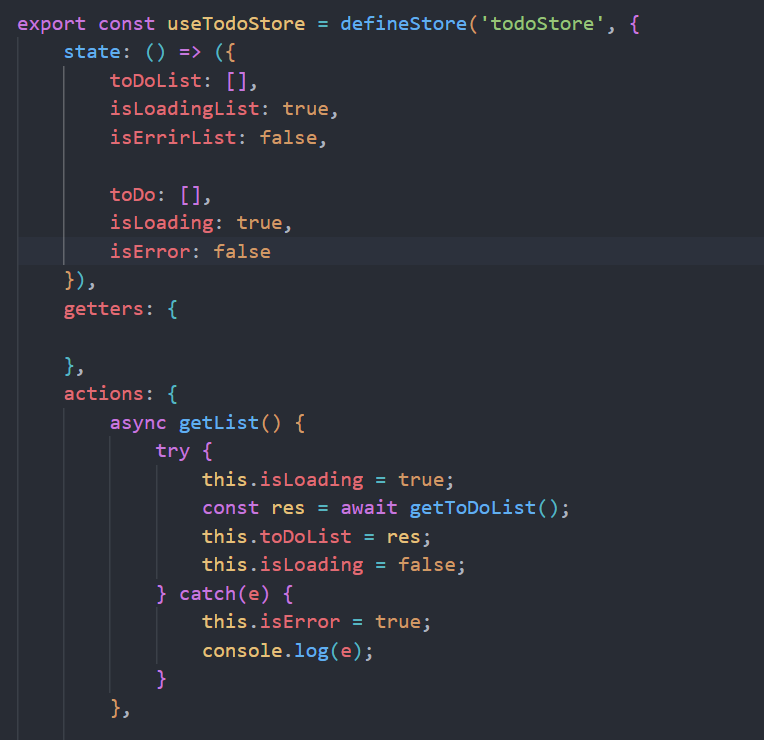

## Инструкции по установке проекта

1. Установить npm
    npm install
2. Установить все необходимые библиотеки
    vue-router 
    axios
    pinia

## Описание проекта

Проект предоставляет todo список, которые вытягиваются из общедоступного API dummyjson.
Присутствуют некоторые возможности взаимодейтсвия: добавление в избранные, добавление новых todo в локальный стейт, а также представленны возможности Vue роутера.

## Примеры использования

1. Инициализирование стейт менеджера

2. Создание самого хранилища

## Ответы на контрольные вопросы

1. Что представляет собой `Pinia` и для чего используется?
Pinia - это библиотека управления состоянием (state management) для Vue.js. Она предоставляет простой и эффективный способ управления состоянием приложения, используя парадигму Flux и концепцию хранилищ (stores). Pinia разработана для управления состоянием Vue-приложений, предлагая удобный API для создания хранилищ данных.

2. Что такое стейт-менеджмент во фронтенд-разработке?
Стейт-менеджмент во фронтенд-разработке относится к управлению состоянием приложения. Это практика хранения и управления данными, которые могут влиять на состояние пользовательского интерфейса. Это может включать в себя данные о пользователе, настройки, состояние компонентов и многое другое. Цель стейт-менеджмента состоит в том, чтобы упростить управление состоянием приложения, сделать его предсказуемым и легко масштабируемым.

3. В каких случаях целесообразно применять стейт-менеджеры?
Стейт-менеджеры полезны в различных случаях, включая:
    3.1. Крупные приложения с большим объемом состояния: Когда приложение становится большим, управление состоянием становится сложнее. Стейт-менеджеры помогают организовать данные и их обновление.
    3.2. Состояние, используемое в нескольких компонентах: Если состояние нужно использовать в нескольких местах приложения, стейт-менеджеры обеспечивают централизованный доступ к этим данным.
    3.3. Отслеживание состояния приложения: Приложения, где важно отслеживать историю изменений состояния или восстанавливать состояние после перезагрузки страницы, могут воспользоваться стейт-менеджерами для управления этим.
